# dCTF
- [dCTF](#dctf)
- [1. MISC](#1-misc)
    - [1.1 Encrypted Flag I Have](#11-encrypted-flag-i-have)
    - [1.2 Dragon](#12-dragon)
    - [1.3 Don't Let it run](#13-dont-let-it-run)
    - [1.4 Hidden Message](#14-hidden-message)
    - [1.5 Leaked spin](#15-leaked-spin)
    - [1.6 Extraterrestial Communication](#16-extraterrestial-communication)
    - [1.7 Powerpoint Programming](#17-powerpoint-programming)
    - [1.8 Show us your ID](#18-show-us-your-id)
    - [1.9 Company Leak](#19-company-leak)
- [2. Crypto](#2-crypto)
    - [2.1 Forgotten Secret](#21-forgotten-secret)
    - [2.2 Strong Password](#22-strong-password)
    - [2.3 Julius' ancient script](#23-julius-ancient-script)
    - [2.4 Just Take Your Time](#24-just-take-your-time)
    - [2.5 Scooby-doo](#25-scooby-doo)
    - [2.6 Private Encryption Mistake](#26-private-encryption-mistake)
    - [2.7 A Simple SP Box!](#27-a-simple-sp-box)
    - [2.8 This one is really basic](#28-this-one-is-really-basic)
    - [2.9 Data Recovery](#29-data-recovery)
    - [2.10 Lockpicking](#210-lockpicking)
- [3. Web](#3-web)
    - [3.1 DevOps vs SecOps](#31-devops-vs-secops)
    - [3.2 Simple Web](#32-simple-web)

# 1. MISC
#### 1.1 Encrypted Flag I Have

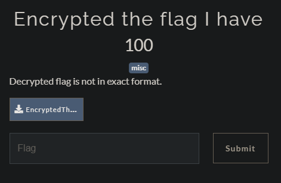

First off we start with this. It looks like yoda-ism, lets take a look at the file.


Indeed I was correct. It's Star Wars language called Aurebesh. We can use a decoder from [dcode.fr](https://www.dcode.fr/aurebesh-alphabet). It's missing {} letter's but we can add them to the flag ourself.
Once decoded the flag is: DCTF{MASTERCODEBREAKER}

#### 1.2 Dragon
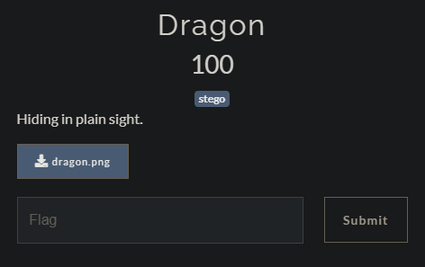

Let's check the file


We use [Aperisolve](https://aperisolve.fr/4a8a0f4de960dcedac96b13267b1c0c7) to analyze the file and we got the flag from the blue spectrum
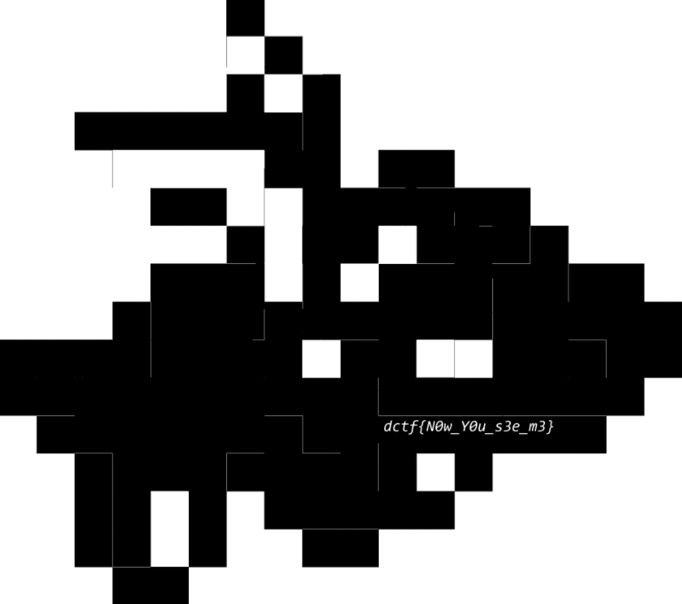

#### 1.3 Don't Let it run
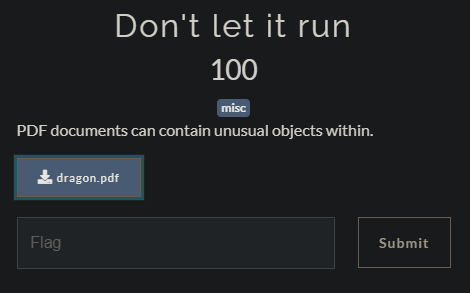

At first when opening the [PDF](./DontLetItRun/dragon.pdf) there's just a picture of the same dragon as in previous challege so I decided to run strings on the file

`strings -n7 dragon.pdf`

Right off the bat we can see there's javascript that looks like it's HEX encoded.

Let's grab that string and and run a command.

```bash
$ echo 766172205F3078346163393D5B2736363361435968594B272C273971776147474F272C276C6F67272C273150744366746D272C27313036387552596D7154272C27646374667B7064665F316E6A33637433647D272C273736383537376A6868736272272C2737313733343268417A4F4F51272C27373232353133504158436268272C2738333339383950514B697469272C27313434373836335256636E546F272C2731323533353356746B585547275D3B2866756E6374696F6E285F30783362316636622C5F3078316164386237297B766172205F30783536366565323D5F3078353334373B7768696C652821215B5D297B7472797B766172205F30783237353061353D7061727365496E74285F307835363665653228307831366529292B2D7061727365496E74285F307835363665653228307831366429292B7061727365496E74285F307835363665653228307831366329292B2D7061727365496E74285F307835363665653228307831373329292A2D7061727365496E74285F307835363665653228307831373129292B7061727365496E74285F307835363665653228307831373229292A2D7061727365496E74285F307835363665653228307831366129292B7061727365496E74285F307835363665653228307831366629292A7061727365496E74285F307835363665653228307831373529292B2D7061727365496E74285F307835363665653228307831373029293B6966285F30783237353061353D3D3D5F307831616438623729627265616B3B656C7365205F30783362316636625B2770757368275D285F30783362316636625B277368696674275D2829293B7D6361746368285F3078353736346134297B5F30783362316636625B2770757368275D285F30783362316636625B277368696674275D2829293B7D7D7D285F3078346163392C3078386439376629293B66756E6374696F6E205F30786128297B766172205F30783363366432303D5F3078353334373B636F6E736F6C655B5F3078336336643230283078313734295D285F307833633664323028307831366229293B7D76617220613D27626B706F646E746A636F7073796D6C78656977686F6E7374796B787372707A79272C623D2765787262737071717573746E7A717269756C697A70656565787771736F666D77273B5F30786228612C62293B66756E6374696F6E205F307835333437285F30783337646533352C5F3078313961633236297B5F30783337646533353D5F30783337646533352D30783136613B766172205F30783461633965613D5F3078346163395B5F30783337646533355D3B72657475726E205F30783461633965613B7D66756E6374696F6E205F307862285F30783339623365652C5F3078666165353433297B766172205F30783235393932333D5F30783339623365652B5F30786661653534333B5F30786128293B7D0A |unhex
var _0x4ac9=['663aCYhYK','9qwaGGO','log','1PtCftm','1068uRYmqT','dctf{pdf_1nj3ct3d}','768577jhhsbr','717342hAzOOQ','722513PAXCbh','833989PQKiti','1447863RVcnTo','125353VtkXUG'];(function(_0x3b1f6b,_0x1ad8b7){var _0x566ee2=_0x5347;while(!![]){try{var _0x2750a5=parseInt(_0x566ee2(0x16e))+-parseInt(_0x566ee2(0x16d))+parseInt(_0x566ee2(0x16c))+-parseInt(_0x566ee2(0x173))*-parseInt(_0x566ee2(0x171))+parseInt(_0x566ee2(0x172))*-parseInt(_0x566ee2(0x16a))+parseInt(_0x566ee2(0x16f))*parseInt(_0x566ee2(0x175))+-parseInt(_0x566ee2(0x170));if(_0x2750a5===_0x1ad8b7)break;else _0x3b1f6b['push'](_0x3b1f6b['shift']());}catch(_0x5764a4){_0x3b1f6b['push'](_0x3b1f6b['shift']());}}}(_0x4ac9,0x8d97f));function _0xa(){var _0x3c6d20=_0x5347;console[_0x3c6d20(0x174)](_0x3c6d20(0x16b));}var a='bkpodntjcopsymlxeiwhonstykxsrpzy',b='exrbspqqustnzqriulizpeeexwqsofmw';_0xb(a,b);function _0x5347(_0x37de35,_0x19ac26){_0x37de35=_0x37de35-0x16a;var _0x4ac9ea=_0x4ac9[_0x37de35];return _0x4ac9ea;}function _0xb(_0x39b3ee,_0xfae543){var _0x259923=_0x39b3ee+_0xfae543;_0xa();}
```
There we go, we go it unhexed and flag is looking right at us!

#### 1.4 Hidden Message

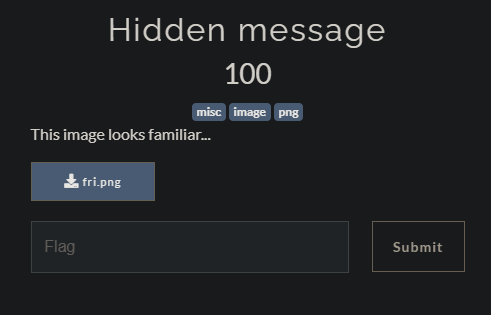

Let's download the [file](./images/fri.png) and check it out. After zooming around the file I couldn't find anything unusual so I decided to run `zsteg -a fri.png` to check if there's anything hidden in the bits

```bash
$ zsteg -a images/fri.png
b1,rgb,lsb,xy       .. text: "dctf{sTeg0noGr4Phy_101}"
b3,g,lsb,xy         .. text: "I@4I)$Xl"
```
The very first line revealed us the flag!

#### 1.5 Leaked spin
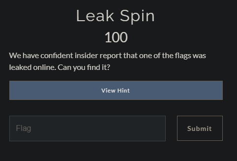

Let's check the hint first before even trying to figure out anything.

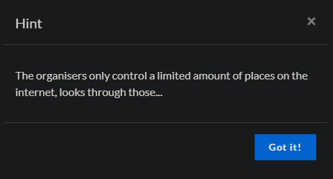

So it's a kind of OSINT challenge, alright I'm confident I can do this. First I google [dragonsecsi github](https://www.google.com/search?q=dragonsecsi) and I go in [there](https://github.com/DragonSecSI). We can find that there's repository called `DCTF1-chall-leak-spin` so let's jump in there and check it out. There's a file called challenge.yml and it contains the flag:
```yml
name: "Leak Spin"
author: "Miha M."
category: Web

description: We have confident insider report that one of the flags was leaked online. Can you find it?
value: 100
type: standard

flags:
  - dctf{I_L1k3_L1evaAn_P0lkk4}

tags:
  - web

state: visible
  
version: "1.0"
```


#### 1.6 Extraterrestial Communication
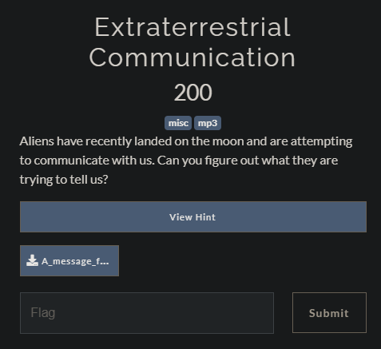

Let's check out the hint first.

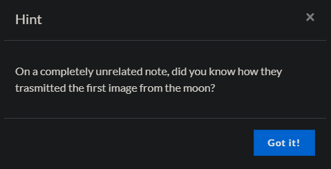

Hint provides us with enough information. The first images we're transmitted with SSTV a.k.a Slow Scan Television.

We can use [RX-SSTV](http://users.belgacom.net/hamradio/rxsstv.htm) for this.
With RX option Scottie 1 we can decode the signal into a picture. Play the mp3 file and let the RX-SSTV do it's magic.

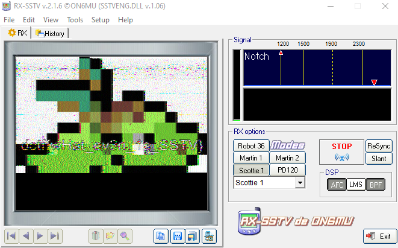

Flag: dctf{wHat_ev3n_1s_SSTV}

#### 1.7 Powerpoint Programming

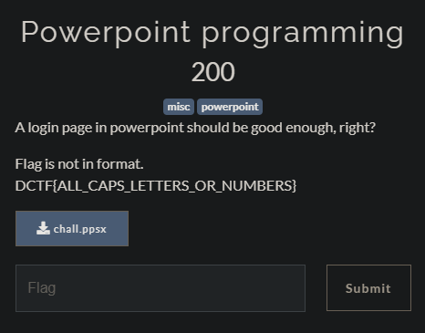

Let's open the [file](PowerPoint_Programming/chall.ppsx) in powerpoint. We see 3 slides one with keypad and submit button, one with Correct text and one with Wrong text. Let's check out the Animations tab, from here we can see that some of the key's have a little lightning symbol beside them which means they're being used in an animation.
Click on the Animation pane and a sidebar opens up with the animations. Scroll down and you can see full animation list.
Just follow the animation instructions in the sidebar and read the flag: dctf{ppt_1snt_v3ry_s3cur3_1s_1t}

#### 1.8 Show us your ID

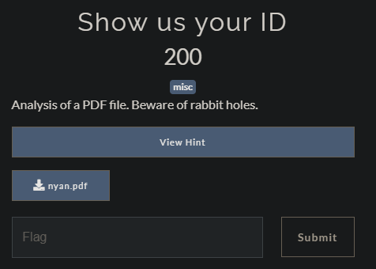

Let's check the hint first

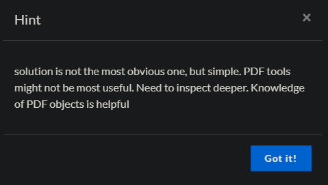

Let's open the file with `strings`. 

```
%PDF-1.3
1 0 obj
/Pages 2 0 R
/Type /Catalog
2 0 obj
/Type /Pages
/Kids [ 3 0 R ]
/Count 1
3 0 obj
/Type /Page
/Parent 2 0 R
/Resources <<
/XObject << /Im0 8 0 R >>
/ProcSet 6 0 R >>
/MediaBox [0 0 613 344]
/CropBox [0 0 613 344]
/Contents 4 0 R
/Thumb 11 0 R
4 0 obj
/Length 5 0 R
613 0 0 344 0 0 cm
/Im0 Do
endstream
5 0 obj
6 0 obj
[ /PDF /Text /ImageC ]
7 0 obj
8 0 obj
/Type /XObject
/Subtype /Image
/Name /Im0
/Filter [ /DCTDecode ]
/Width 613
/Height 344
/ColorSpace 10 0 R
/BitsPerComponent 8
/Length 9 0 R
.Photoshop 3.0
printOutput
PstSbool
Inteenum
printSixteenBitbool
printerNameTEXT
printProofSetupObjc
proofSetup
Bltnenum
builtinProof
        proofCMYK
printOutputOptions
Cptnbool
Clbrbool
RgsMbool
CrnCbool
CntCbool
Lblsbool
Ngtvbool
EmlDbool
Intrbool
BckgObjc
Rd  doub@o
Grn doub@o
```
A whole bunch of stuff.. that doesnt help much. The challenge name gave an idea. Let's grep the file.

```js
$ grep -a -o "id=.*" nyan.pdf
id="646374667b3362306261347d"?>
...
```

Still a whole lot of stufff but only one thing we're interested in `id="646374667b3362306261347d"`. That looks like a hex encoded string.
Lets use unhex on it.
```bash
$ echo 646374667b3362306261347d |unhex
dctf{3b0ba4}
```
We got the flag!

#### 1.9 Company Leak

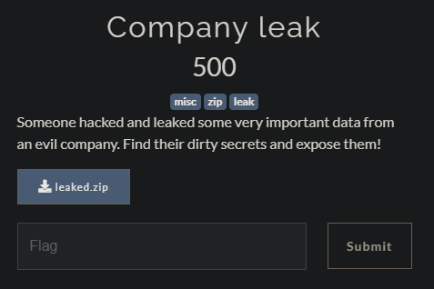

We get this [zipfile](./Company_Leak/leaked.zip) so lets unzip it `unzip leaked.zip`.
We got two new files. [README.md](Company_Leak/README.md) and [super_secret.zip](Company_Leak/super_secret.zip)

We tried using John the ripper to crack the hash with no success. We tried using [CRC32 cracker](https://github.com/kmyk/zip-crc-cracker) for it without success. Then after some googling we found about [bkcrack](https://github.com/kimci86/bkcrack) which was the correct program to get it cracked. Here's how it happened.

```bash
$ bkcrack -C super_secret.zip -c README.md -P README.zip -p README.md
bkcrack 1.2.2 - 2021-05-17
[20:00:18] Z reduction using 285 bytes of known plaintext
100.0 % (285 / 285)
[20:00:19] Attack on 27016 Z values at index 7
Keys: a33fbdc6 5b49420e 6589766e
66.9 % (18073 / 27016)
[20:00:23] Keys
a33fbdc6 5b49420e 6589766e

$ bkcrack -C super_secret.zip -k a33fbdc6 5b49420e 6589766e -U not_so_secret.zip password
bkcrack 1.2.2 - 2021-05-17
[20:04:46] Writing unlocked archive not_so_secret.zip with password "password"
100.0 % (2 / 2)
Wrote unlocked archive.

$ unzip not_so_secret.zip
Archive:  not_so_secret.zip
[not_so_secret.zip] README.md password:
replace README.md? [y]es, [n]o, [A]ll, [N]one, [r]ename: r
new name: not_so_secret_README.md
  inflating: not_so_secret_README.md
  inflating: top_secret.txt

£ cat top_secret.txt
I'd just like to interject for a moment. What you're referring to as Linux, is in fact, GNU/Linux, or as I've recently taken to calling it, GNU plus Linux. Linux is not an operating system unto itself, but rather another free component of a fully functioning GNU system made useful by the GNU corelibs, shell utilities and vital system components comprising a full OS as defined by POSIX.

dctf{wew_lad_y0u_aCtually_d1d_it}

Many computer users run a modified version of the GNU system every day, without realizing it. Through a peculiar turn of events, the version of GNU which is widely used today is often called "Linux", and many of its users are not aware that it is basically the GNU system, developed by the GNU Project.

There really is a Linux, and these people are using it, but it is just a part of the system they use. Linux is the kernel: the program in the system that allocates the machine's resources to the other programs that you run. The kernel is an essential part of an operating system, but useless by itself; it can only function in the context of a complete operating system. Linux is normally used in combination with the GNU operating system: the whole system is basically GNU with Linux added, or GNU/Linux. All the so-called "Linux" distributions are really distributions of GNU/Linux.

(text above is a joke)
```


# 2. Crypto
#### 2.1 Forgotten Secret
image > unrar file > cat 7dabd7d32d701c6380d8e9f053d83d050569b063fbcf7ebc65e69404bed867a5.json |jq . > find out id_rsa, SECRET_KEY, cipher.bin > find them in folders > puttygen id_rsa -O private-openssh -o dctf.pem (password is SECRET_KEY) > openssl rsautl -decrypt -in cipher.bin -out unciphered.txt -inkey dctf.pem > cat unciphered.txt > dctf{k33p_y0r_k3ys_s4f3}

#### 2.2 Strong Password

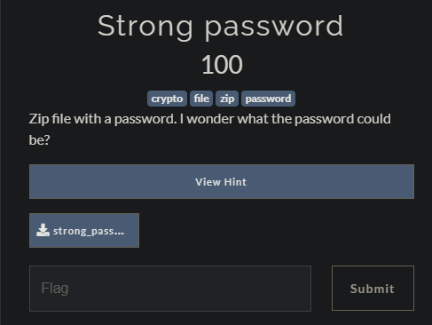

Let's check the hint!

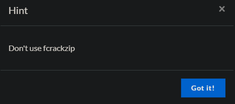

Alright so the hint tells us not to use `fcrackzip` which is probably the most used zip cracker. But good thing we know how to run John the ripper.

Lets do this!

```bash
$ zip2john strong_password.zip > strong.hash
ver 2.0 efh 9901 strong_password.zip/lorem_ipsum.txt PKZIP Encr: cmplen=5171, decmplen=17174, crc=CEFA3672

$ john --wordlist=/usr/share/wordlists/rockyou.txt strong.hash
Using default input encoding: UTF-8
Loaded 1 password hash (ZIP, WinZip [PBKDF2-SHA1 512/512 AVX512BW 16x])
No password hashes left to crack (see FAQ)

$ john --show strong.hash
strong_password.zip/lorem_ipsum.txt:Bo38AkRcE600X8DbK3600:lorem_ipsum.txt:strong_password.zip:strong_password.zip

1 password hash cracked, 0 left

$ unzip strong_password.zip
Archive:  strong_password.zip
   skipping: lorem_ipsum.txt         unsupported compression method 99

$ 7z x strong_password.zip -pBo38AkRcE600X8DbK3600

7-Zip [64] 16.02 : Copyright (c) 1999-2016 Igor Pavlov : 2016-05-21
p7zip Version 16.02 (locale=en_US.UTF-8,Utf16=on,HugeFiles=on,64 bits,36 CPUs Intel(R) Core(TM) i9-9980XE CPU @ 3.00GHz (50654),ASM,AES-NI)

Scanning the drive for archives:
1 file, 5373 bytes (6 KiB)

Extracting archive: strong_password.zip
--
Path = strong_password.zip
Type = zip
Physical Size = 5373

Everything is Ok

Size:       17174
Compressed: 5373

$ grep -o dctf.* lorem_ipsum.txt
dctf{r0cKyoU_f0r_tHe_w1n} Etiam in volutpat nunc. Aliquam erat volutpat. Ut dapibus, sem at posuere sollicitudin, tellus elit faucibus ligula, ut malesuada leo erat eu sem. Nam nulla lacus, feugiat placerat porttitor eu, sodales quis quam. Duis efficitur, nisl ege
```
We got the flag: dctf{r0cKyoU_f0r_tHe_w1n}

#### 2.3 Julius' ancient script

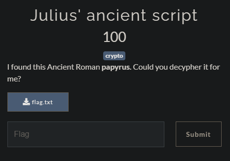

We get a file with one line in it `rq7t{7vH_rFH_vI6_pHH1_qI67}`. Looks like a basic caesar shift cipher but there's numbers involved.
Because there are number we can use [this online tool](https://planetcalc.com/8572/)
Paste the line there and press calculate. Result is in ROT22 dctf{th3_d13_h4s_b33n_c4st}

#### 2.4 Just Take Your Time
just_take_your_time.py > crack the stuff and get flag

#### 2.5 Scooby-doo
name of the van is Mystery Machine > some kind of Enigma cipher > cipher.txt > 10000 lines of gibberish > make a script to compare the lines with alphabet > get flag > DCTFTURINGWOULDBEPROUD > DCTFTURINGWOULDBEPROUD add braces > DCTF{TURINGWOULDBEPROUD}

#### 2.6 Private Encryption Mistake
blurred.png > https://blog.cryptohack.org/twitter-secrets > is exactly the same > follow instructions in the blog post and get the key > dctf{Y0u_Are_N0w_Br34thing_M4nua11y}

#### 2.7 A Simple SP Box!

#### 2.8 This one is really basic
cipher.txt > description with "The answer to life, the universe, and everything." movie line from Hitchikers Guide to the Galaxy and the answer to that is 42 > 42xbase64 decode > dctf{Th1s_l00ks_4_lot_sm4ll3r_th4n_1t_d1d}

#### 2.9 Data Recovery
recovered_data.zip > unzip > file ./* > cat encrypted1 > base64 > https://gchq.github.io/CyberChef/#recipe=From_Base64('A-Za-z0-9%2B/%3D',true)XOR(%7B'option':'Hex','string':'6a'%7D,'Standard',false)Unzip('',false) cyberchef base64, magic=xor into zip file > unzip > very_important.txt > ctrl+f dctf > dctf{x0r_eNcRypt1on_brUt3foRce}

#### 2.10 Lockpicking

Didn't solve this one during CTF, challenge can be found [here](./Lockpicking/lockpicking.py) and solve can be found in [here](./Lockpicking/lockpicking_solve.py)


# 3. Web
#### 3.1 DevOps vs SecOps

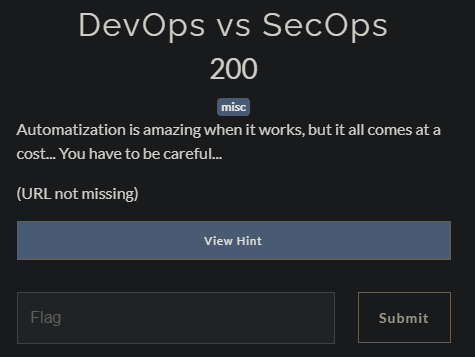

Let's check the hint just in case.

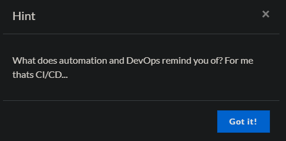

Hint gives us information about CI/CD which can be done with github! So let's go find out more from their [github](https://github.com/DragonSecSI).
There's a repo called DCTF1-chall-devops-vs-secops, we check it out and we notice there's 2 different branches.
Main and devops. There's nothing in the main branch but maybe there's something in the devops. Changing branch and we see a new directory .github/workflows in the workflow directory there's ctfd.yml file

```yml
name: CTFD
on:
  push:
    branches: [ devops ]
  pull_request:
    branches: [ devops ]

jobs:
  build:
    runs-on: ubuntu-18.04
    container:
      image: docker.pkg.github.com/dragonsecsi/infra/ghactions:1.0
      credentials:
        username: Aleks-dotcom
        password: ${{ secrets.REGISTRY_TOKEN }}
    steps:
      - name: Checkout repo
        uses: actions/checkout@v2
      - name: Checkout .github
        uses: actions/checkout@v2
        with:
          repository: dragonsecsi/.github
          path: ./data
      - name: ctfd upload challenge
        run: python3 data/setup.py ${{ secrets.ADMIN_TOKEN }}
```

Here we can see it uses a different repo `repository: dragonsecsi/.github` so we need to check that out as well since the flag wasn't here.

Going to `.github` repo we find setup.py file with the flag inside.

```py
import os
import re
import sys

def init():
    #change this:
    CTFD_TOKEN = sys.argv[1]
    #change this:
    CTFD_URL = "https://dctf.dragonsec.si"
    

    os.system(f"echo '{CTFD_URL}\n{CTFD_TOKEN}\ny' | ctf init")

def file():
    for subdirs, dirs, files in os.walk(".."):
        for dirr in dirs:
            if "DCTF-chall" in dirr:
                return dirr

if __name__ == "__main__":
    init()
    print("dctf{H3ll0_fr0m_1T_guy}")
    os.system(f"ctf challenge sync challenge.yml ;ctf challenge install challenge.yml ")
```


#### 3.2 Simple Web

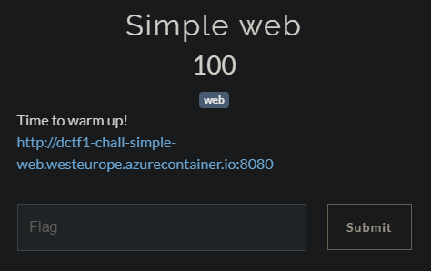

Lets go to the [site](http://dctf1-chall-simple-web.westeurope.azurecontainer.io:8080/). On checking the website, it just a basic website with a simple checkbox and submit button. On submitting the form and intercepting the request, you will notice it sends the following data to `/flag` route.

```html
flag=1&auth=0&Submit=Submit
```

On changing auth from `0` to `1` and sending the request, you will get the flag.
```bash
$ curl "http://dctf1-chall-simple-web.westeurope.azurecontainer.io:8080/flag" --data "flag=1&auth=1&Submit=Submit"
There you go: dctf{w3b_c4n_b3_fun_r1ght?}
```

On changing auth from `0` to `1` and sending the request, you will get the flag.

